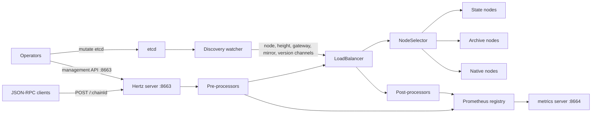

# Design Architecture

English | [中文](architecture_cn.md)

This document describes the runtime architecture of nodex-proxy as implemented in the current codebase. It focuses on component boundaries, request flow, dynamic configuration, and operational behavior.

## Goals

- Provide a single JSON-RPC entrypoint for many blockchain chains.
- Select healthy upstream nodes by chain, block context, node role, method route, and load-balancing strategy.
- Keep node membership, weights, method routing, mirrors, heights, and version overrides dynamic through etcd.
- Expose operational signals through Prometheus metrics, OpenTelemetry traces, and structured logs.
- Keep the process simple to deploy: one RPC/admin listener and one metrics listener.

## Runtime Topology



The same Hertz listener serves both public JSON-RPC requests and management endpoints. The metrics endpoint is served by a separate HTTP server on `metric_listen`.

## Main Components

| Component | Code | Responsibility |
|-----------|------|----------------|
| Process entrypoint | `cmd/proxy/main.go` | Load config, initialize etcd discovery, construct the load balancer, register management and JSON-RPC routes, start RPC/admin and metrics servers. |
| Config loader | `config/config.go`, `types/config.go` | Load top-level launch config and nested `proxy_config`, then fill proxy defaults. |
| etcd discovery | `discovery/etcd/discovery.go` | Load initial etcd state, watch dynamic updates, and publish typed events into channels. |
| Load balancer | `lb/lb.go` | Own request orchestration, preprocessing, node selection, upstream proxying, retry behavior, and postprocessing. |
| Node selector | `lb/selector/*` | Store per-chain node pools and choose a node using random weighted or round-robin strategies. |
| Gateway strategy | `lb/jsonrpc/gateway_map.go` | Maintain node weights and method routing rules for the random selector. |
| Request processors | `lb/jsonrpc/handler.go`, `lb/jsonrpc/hertz_process.go` | Validate methods, update metrics, enforce limits, rewrite special requests, mirror traffic, parse responses, and emit logs. |
| Management API | `http_handler/*` | Manage nodes, weights, method routes, writers, and mirror targets. Persistent changes are written to etcd where applicable. |

## Configuration Boundaries

The binary expects a top-level launch config:

```yaml
listen: "8663"
metric_listen: "8664"
etcd_endpoints:
  - "http://127.0.0.1:2379"
log_level: "info"
proxy_config:
  default_rpc_timeout: 5000
  connection_pool_size: 2000
  node_select_strategy: "random"
```

`listen` and `metric_listen` belong to the process wrapper. Runtime proxy behavior belongs under `proxy_config`.

Important boundaries:

- `-listen` overrides only the RPC/admin listen port. The server binds as `0.0.0.0:<listen>`.
- `metric_listen` controls the Prometheus endpoint port.
- `proxy_config` is loaded once at startup. Node, height, gateway, mirror, and version data are updated dynamically through etcd.
- Management endpoints share the RPC/admin listener. Put this listener behind a trusted network boundary or an external auth layer when exposed outside an internal environment.

## Request Lifecycle

1. A client sends a JSON-RPC request to `/:chainId`.
2. `LoadBalancer.ServeHTTP` parses the JSON-RPC body and builds a `RequestContext`.
3. The chain id is normalized. Hex numeric ids become decimal strings. If the request uses a base chain without an explicit version suffix, the chain version router may rewrite it to the active version from etcd.
4. Pre-processors run in order:

```text
log request
method deny list
method name checker
preprocessor metrics
method rate limiter
method-specific pre-handler
request mirror
```

5. The selector chooses candidate nodes by request block context:

| Request context | Preferred node pool |
|-----------------|---------------------|
| `latest` or `pending` block | State nodes |
| Explicit block within 64 blocks of known head | State nodes |
| Explicit block older than 64 blocks behind known head | Archive nodes |
| Contains-style block context | State nodes |
| Native retry | Native nodes |

If a selected pool is empty, state and archive pools fall back to each other. Each pool prefers available nodes when any are available.

6. For `node_select_strategy: "random"`, method routes filter the candidate nodes for non-batch requests, then weights choose the final node. Missing weights default to `100`.
7. For `node_select_strategy: "round_robin"`, nodes are selected round-robin from the candidate pool. Gateway weights and method routes are not applied by this selector.
8. The selected node reverse-proxy handles the upstream request.
9. Retry rules may trigger a second upstream request:

| Error code | Retry target | Notes |
|------------|--------------|-------|
| `StateBlockNotFound` (`-39006`) | Archive node | Only when the first attempt was not already archive. |
| `CosmosPrecompile` (`-39008`) | Native node | Native retry changes the upstream path to `/`. |

10. Post-processors run in order:

```text
parse JSON-RPC response
log response
method-specific post-handler
slow/error observability log
postprocessor metrics
```

## etcd Data Model

The discoverer reads and watches the configured prefix. The key suffixes below are interpreted as typed runtime data:

| Key suffix | Value type | Effect |
|------------|------------|--------|
| `{chainId}/nodes/{nodeKey}` | `TargetNode` JSON | Adds, updates, or removes state/archive nodes after health check. |
| `{chainId}/nativeNodes/{nodeKey}` | `TargetNode` JSON | Adds, updates, or removes native fallback nodes after health check. |
| `{chainId}/lastBlockNumber` | `ChainHeight` JSON | Updates known chain head height for state/archive selection. |
| `{chainId}/gateway` | `Gateway` JSON | Updates node weights and method routes. |
| `{chainId}/mirror/{addrKey}` | `MirrorTarget` JSON | Adds or removes mirror targets and optional mirror rate limits. |
| `{chainId}/version` | JSON string or `{ "version": "..." }` | Overrides base-chain routing to a versioned chain id. |
| `{chainId}/{version}/nodes/{nodeKey}` | `TargetNode` JSON | Registers nodes for a versioned chain. The chain id is normalized to `{chainId}-{version}` internally. |

Node values contain:

```json
{
  "address": "127.0.0.1",
  "port": 8545,
  "nodeType": 1,
  "stateType": 1,
  "weight": 100,
  "source": "manual"
}
```

`nodeType` is `1` for state nodes and `2` for archive nodes. Native nodes are stored under `nativeNodes` and marked with source `native` by the discoverer.

## Control Plane

Management endpoints are registered on the same Hertz server as JSON-RPC traffic. The most important groups are:

| Endpoint group | Purpose |
|----------------|---------|
| `/getChains`, `/:chainId/getAllNodes`, `/:chainId/debug_chooseOneNode` | Inspect known chains, nodes, and selection behavior. |
| `/:chainId/addNode`, `/:chainId/updateNode/:nodeKey`, `/:chainId/deleteNode/:nodeKey` | Persist node changes to etcd. |
| `/:chainId/addLocalNode`, `/:chainId/deleteLocalNode/:nodeKey` | Change in-memory node state without persisting to etcd. |
| `/:chainId/setWeight`, `/:chainId/getWeight`, `/:chainId/deleteWeight` | Manage gateway weights. |
| `/:chainId/addMethodRoute`, `/:chainId/removeMethodRoute`, `/:chainId/deleteMethodRoute/:method` | Manage method-specific include/exclude routing. |
| `/:chainId/addMirror`, `/:chainId/deleteMirror`, `/:chainId/deleteAllMirrors` | Persist mirror targets through etcd. |
| `/:chainId/addLocalMirror`, `/:chainId/deleteLocalMirror`, `/:chainId/deleteAllLocalMirrors` | Change in-memory mirror targets only. |
| `/:chainId/writers/*` | Manage writer leader state. |

Because these endpoints can mutate routing state, they should be exposed only through trusted operations paths.

## Observability

Metrics are exposed at `http://<host>:<metric_listen>/metrics`.

Common metric labels are `host`, `target`, `chain_id`, and `chain_version`. Method metrics add `method`; `jrpcx_rpc_calls_started` adds `sourcedapp`; failed call metrics add `status_code`, `upstream_related`, and `reason`.

Request logs and traces use the request context, including source headers such as `x-dbk-biz`, `x-dbk-source-host`, `x-dbk-source`, `x-dbk-env`, and `x-dbk-server-version`.

Slow/error observability logs are controlled by:

```yaml
proxy_config:
  processor:
    observability_log:
      enable: true
      enable_error_log: true
      slow_threshold:
        default: 500
        rpc_methods:
          eth_call: 1000
```

## Failure Handling

- A newly discovered node is not added to the pool until health check succeeds.
- Health checks retry on a configured interval until `node_health_check_max_wait`.
- No available node returns a JSON-RPC bad gateway style response.
- Upstream HTTP `502` and `504` responses are converted into JSON-RPC error responses and counted by metrics.
- Request mirroring is asynchronous and does not affect the primary response.
- Batch requests are parsed and proxied, but method route filtering is skipped for random selection and batch responses are not parsed as single JSON-RPC response objects.

## Deployment Shape

A typical deployment contains:

```text
clients
  -> load balancer or ingress
    -> nodex-proxy :8663
      -> upstream state/archive/native blockchain nodes

operators
  -> trusted admin path
    -> nodex-proxy management endpoints :8663
    -> etcd

prometheus
  -> nodex-proxy :8664/metrics
```

Run multiple nodex-proxy instances against the same etcd cluster for horizontal scale. Each instance maintains local in-memory selector state from etcd watches, so etcd is the shared control-plane source of truth.
