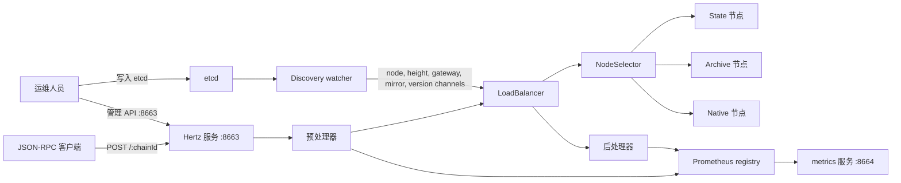

# 设计架构

[English](architecture.md) | 中文

本文档描述 nodex-proxy 当前代码实现中的运行架构，重点说明组件边界、请求链路、动态配置和运维行为。

## 目标

- 为多条区块链提供统一 JSON-RPC 入口。
- 按链、区块上下文、节点角色、方法路由和负载均衡策略选择健康上游节点。
- 通过 etcd 动态维护节点、权重、方法路由、镜像目标、链高度和版本路由。
- 通过 Prometheus 指标、OpenTelemetry trace 和结构化日志输出可观测信号。
- 保持部署形态简单：一个 RPC/管理端口，一个 metrics 端口。

## 运行拓扑



同一个 Hertz listener 同时承载 JSON-RPC 请求和管理接口。Prometheus metrics 由单独的 HTTP server 暴露在 `metric_listen`。

## 核心组件

| 组件 | 代码位置 | 职责 |
|------|----------|------|
| 进程入口 | `cmd/proxy/main.go` | 加载配置，初始化 etcd discovery，构造 load balancer，注册管理接口和 JSON-RPC 路由，启动 RPC/管理服务和 metrics 服务。 |
| 配置加载 | `config/config.go`, `types/config.go` | 读取顶层启动配置和嵌套的 `proxy_config`，再填充 proxy 默认值。 |
| etcd discovery | `discovery/etcd/discovery.go` | 读取 etcd 初始状态，监听动态更新，并通过类型化 channel 推送事件。 |
| LoadBalancer | `lb/lb.go` | 负责请求编排、预处理、节点选择、上游代理、重试逻辑和后处理。 |
| Node selector | `lb/selector/*` | 保存每条链的节点池，并按 random weighted 或 round-robin 策略选择节点。 |
| Gateway strategy | `lb/jsonrpc/gateway_map.go` | 为 random selector 维护节点权重和方法路由规则。 |
| 请求处理器 | `lb/jsonrpc/handler.go`, `lb/jsonrpc/hertz_process.go` | 方法校验、指标更新、限流、特殊方法改写、请求镜像、响应解析和日志输出。 |
| 管理 API | `http_handler/*` | 管理节点、权重、方法路由、writer 和 mirror target；需要持久化的变更写入 etcd。 |

## 配置边界

二进制程序读取顶层启动配置：

```yaml
listen: "8663"
metric_listen: "8664"
etcd_endpoints:
  - "http://127.0.0.1:2379"
log_level: "info"
proxy_config:
  default_rpc_timeout: 5000
  connection_pool_size: 2000
  node_select_strategy: "random"
```

`listen` 和 `metric_listen` 属于进程外层配置。运行时代理行为放在 `proxy_config` 下。

关键边界：

- `-listen` 只覆盖 RPC/管理端口。服务绑定为 `0.0.0.0:<listen>`。
- `metric_listen` 控制 Prometheus metrics 端口。
- `proxy_config` 在启动时读取一次。节点、高度、gateway、mirror 和 version 数据通过 etcd 动态更新。
- 管理接口与 JSON-RPC 共用 RPC/管理端口。如果该端口暴露到内部环境之外，需要放在可信网络或外部认证层之后。

## 请求生命周期

1. 客户端向 `/:chainId` 发送 JSON-RPC 请求。
2. `LoadBalancer.ServeHTTP` 解析 JSON-RPC body，并构造 `RequestContext`。
3. chain id 会被规范化。十六进制数字 id 会转成十进制字符串。如果请求使用基础链 id 且没有显式版本后缀，chain version router 会根据 etcd 中的当前版本做一次路由改写。
4. 预处理器按如下顺序运行：

```text
log request
method deny list
method name checker
preprocessor metrics
method rate limiter
method-specific pre-handler
request mirror
```

5. selector 根据请求区块上下文选择候选节点池：

| 请求上下文 | 优先节点池 |
|------------|------------|
| `latest` 或 `pending` 区块 | State 节点 |
| 明确区块且距离已知链头 64 块以内 | State 节点 |
| 明确区块且落后已知链头超过 64 块 | Archive 节点 |
| Contains 类型区块上下文 | State 节点 |
| Native retry | Native 节点 |

如果被选中的 state/archive 节点池为空，二者会互相兜底。每个节点池在存在可用节点时优先使用可用节点。

6. 当 `node_select_strategy: "random"` 时，非 batch 请求会先按方法路由过滤候选节点，再按权重选择最终节点。没有显式权重的节点默认权重为 `100`。
7. 当 `node_select_strategy: "round_robin"` 时，从候选节点池中按轮询选择。该 selector 不应用 gateway 权重和方法路由。
8. 被选中的节点通过 reverse proxy 接收上游请求。
9. 特定错误会触发第二次上游请求：

| 错误码 | 重试目标 | 说明 |
|--------|----------|------|
| `StateBlockNotFound` (`-39006`) | Archive 节点 | 仅当第一次请求不是 archive 请求时触发。 |
| `CosmosPrecompile` (`-39008`) | Native 节点 | Native retry 会把上游 path 改为 `/`。 |

10. 后处理器按如下顺序运行：

```text
parse JSON-RPC response
log response
method-specific post-handler
slow/error observability log
postprocessor metrics
```

## etcd 数据模型

discoverer 读取并监听配置的 prefix。以下 key 后缀会被解释成运行时数据：

| Key 后缀 | Value 类型 | 作用 |
|----------|------------|------|
| `{chainId}/nodes/{nodeKey}` | `TargetNode` JSON | 健康检查通过后添加、更新或删除 state/archive 节点。 |
| `{chainId}/nativeNodes/{nodeKey}` | `TargetNode` JSON | 健康检查通过后添加、更新或删除 native fallback 节点。 |
| `{chainId}/lastBlockNumber` | `ChainHeight` JSON | 更新已知链头高度，用于 state/archive 选择。 |
| `{chainId}/gateway` | `Gateway` JSON | 更新节点权重和方法路由。 |
| `{chainId}/mirror/{addrKey}` | `MirrorTarget` JSON | 添加或删除 mirror target，以及可选 mirror 限流。 |
| `{chainId}/version` | JSON 字符串或 `{ "version": "..." }` | 将基础链路由覆盖到某个版本化 chain id。 |
| `{chainId}/{version}/nodes/{nodeKey}` | `TargetNode` JSON | 注册版本化链节点，内部 chain id 会规范化成 `{chainId}-{version}`。 |

节点 value 示例：

```json
{
  "address": "127.0.0.1",
  "port": 8545,
  "nodeType": 1,
  "stateType": 1,
  "weight": 100,
  "source": "manual"
}
```

`nodeType` 为 `1` 表示 state 节点，为 `2` 表示 archive 节点。native 节点存放在 `nativeNodes` 下，并由 discoverer 标记为 source `native`。

## 控制面

管理接口注册在和 JSON-RPC 相同的 Hertz server 上，主要分组如下：

| 接口组 | 作用 |
|--------|------|
| `/getChains`, `/:chainId/getAllNodes`, `/:chainId/debug_chooseOneNode` | 查看已知链、节点和选择行为。 |
| `/:chainId/addNode`, `/:chainId/updateNode/:nodeKey`, `/:chainId/deleteNode/:nodeKey` | 将节点变更持久化到 etcd。 |
| `/:chainId/addLocalNode`, `/:chainId/deleteLocalNode/:nodeKey` | 只修改内存中的节点状态，不持久化到 etcd。 |
| `/:chainId/setWeight`, `/:chainId/getWeight`, `/:chainId/deleteWeight` | 管理 gateway 权重。 |
| `/:chainId/addMethodRoute`, `/:chainId/removeMethodRoute`, `/:chainId/deleteMethodRoute/:method` | 管理方法级 include/exclude 路由。 |
| `/:chainId/addMirror`, `/:chainId/deleteMirror`, `/:chainId/deleteAllMirrors` | 通过 etcd 持久化 mirror target。 |
| `/:chainId/addLocalMirror`, `/:chainId/deleteLocalMirror`, `/:chainId/deleteAllLocalMirrors` | 只修改内存中的 mirror target。 |
| `/:chainId/writers/*` | 管理 writer leader 状态。 |

这些接口可以修改路由状态，只应该暴露在可信运维路径上。

## 可观测性

metrics 暴露在 `http://<host>:<metric_listen>/metrics`。

通用指标标签为 `host`、`target`、`chain_id` 和 `chain_version`。按方法统计的指标增加 `method`；`jrpcx_rpc_calls_started` 增加 `sourcedapp`；失败指标增加 `status_code`、`upstream_related` 和 `reason`。

请求日志和 trace 使用 `RequestContext`，包括 `x-dbk-biz`、`x-dbk-source-host`、`x-dbk-source`、`x-dbk-env`、`x-dbk-server-version` 等来源 header。

慢请求和错误观测日志由以下配置控制：

```yaml
proxy_config:
  processor:
    observability_log:
      enable: true
      enable_error_log: true
      slow_threshold:
        default: 500
        rpc_methods:
          eth_call: 1000
```

## 故障处理

- 新发现节点只有健康检查通过后才会加入节点池。
- 健康检查按配置间隔重试，直到 `node_health_check_max_wait`。
- 没有可用节点时返回 JSON-RPC bad gateway 风格响应。
- 上游 HTTP `502` 和 `504` 会转换成 JSON-RPC error response，并被指标统计。
- request mirror 是异步行为，不影响主请求响应。
- batch 请求会被解析和代理，但 random selector 会跳过方法路由过滤，batch 响应不会按单个 JSON-RPC response object 解析。

## 部署形态

典型部署拓扑：

```text
clients
  -> load balancer or ingress
    -> nodex-proxy :8663
      -> upstream state/archive/native blockchain nodes

operators
  -> trusted admin path
    -> nodex-proxy management endpoints :8663
    -> etcd

prometheus
  -> nodex-proxy :8664/metrics
```

可以让多个 nodex-proxy 实例连接同一个 etcd 集群实现水平扩展。每个实例都通过 etcd watch 维护本地 selector 状态，因此 etcd 是共享控制面的事实来源。
